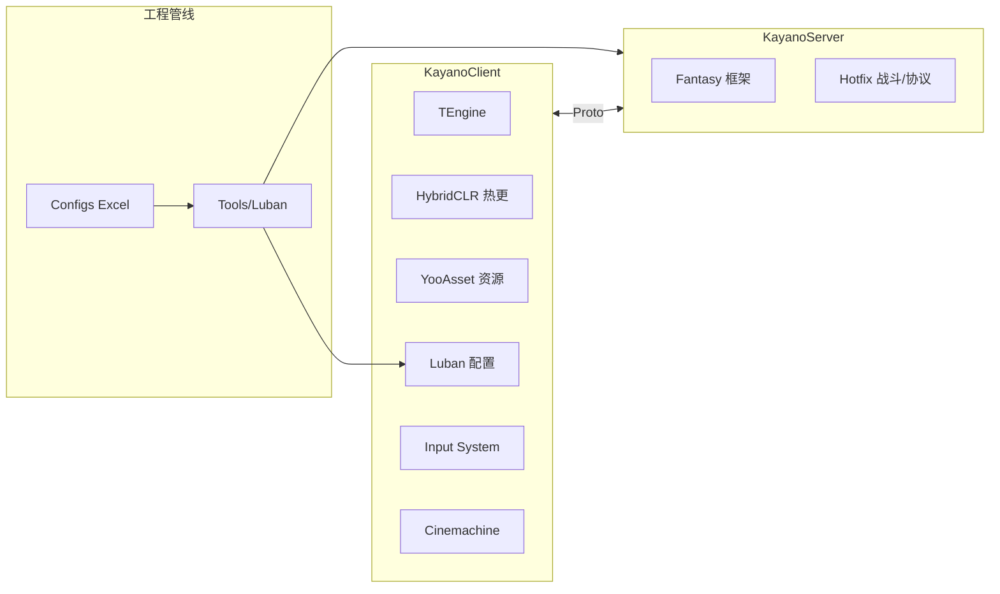

# Kayano · TEngine 6.2.1

基于 [TEngine](https://github.com/ALEXTANGXIAO/TEngine) 的 Unity 客户端 + Fantasy 服务端 monorepo，面向第三人称 ARPG 玩法（动作 Timeline、小队战斗、连携等）。

| 项 | 说明 |
|----|------|
| Unity | **6000.3.8f1**（Unity 6） |
| 渲染 | URP 17.x |
| 客户端框架 | TEngine 6.2 + HybridCLR + YooAsset + UniTask + Luban |
| 服务端 | Fantasy **2026.0.1023**（.NET 8） |
| 相机 | Cinemachine 3.1 |

---

## 仓库结构

```
TEngine-TEngine6.2.1/
├── KayanoClient/          # Unity 工程（打开此目录下的项目）
│   ├── Assets/
│   │   ├── TEngine/       # 框架核心、Editor 工具
│   │   ├── GameScripts/   # Main（AOT）+ HotFix（热更）
│   │   ├── AssetRaw/      # YooAsset 热更资源（UI Prefab、配置等）
│   │   ├── AssetArt/      # 美术与 Timeline 动作资产（体积大，Git 默认忽略）
│   │   └── Scenes/
│   ├── Packages/          # manifest.json、MCPForUnity 等
│   └── ProjectSettings/
├── KayanoServer/          # Fantasy 服务端
│   ├── Main/              # 启动入口
│   ├── Entity/            # 实体与配置
│   └── Hotfix/            # 热更逻辑（战斗、Handler 等）
├── Configs/GameConfig/    # Luban 配置（Excel 源表 + 转表脚本）
├── Tools/                 # Luban、协议导出、FileServer、事件源码生成器等
├── .gitignore             # 仓库级忽略规则（含大资源说明）
└── README.md              # 本文件
```

### 客户端热更程序集（`KayanoClient/Assets/GameScripts/HotFix/`）

| 程序集 | 职责 |
|--------|------|
| **GameProto** | Luban 生成代码、`ConfigSystem` |
| **GameLogic** | 业务逻辑：角色、战斗、输入、UI、Timeline Action 等 |
| **GameBase** | 热更基础层（若存在） |

AOT 入口在 **GameScripts/Main**，热更入口为 **GameLogic/GameApp.cs**。

---

## 技术栈一览



---

## 环境要求

| 工具 | 版本 / 说明 |
|------|-------------|
| Unity Hub | 安装 **6000.3.8f1**（或与 `ProjectVersion.txt` 一致） |
| .NET SDK | **8.0+**（KayanoServer） |
| Git | 克隆与版本管理 |
| Node.js | 可选，用于 `Tools/FileServer` 静态资源服 |

---

## 快速开始

### 1. 克隆仓库

```powershell
git clone https://github.com/YOUR_USER/YOUR_REPO.git
cd TEngine-TEngine6.2.1
```

> 本仓库 `.gitignore` **默认不上传** `Library/`、`AssetArt/`、Luban 二进制 `.bytes`、Excel 源表等。克隆后需按团队文档补全美术与配置资源，或从网盘 / FileServer 拉取。

### 2. 打开 Unity 客户端

1. Unity Hub → **Add** → 选择 `KayanoClient` 文件夹  
2. 首次打开等待 Package 解析与脚本编译  
3. 打开场景：`Assets/Scenes/main.unity`

### 3. HybridCLR（首次或升级后）

在 Unity 菜单执行 HybridCLR 相关 Generate / Compile（以项目内菜单为准），确保热更 DLL 与 AOT 补元数据就绪。详见 `KayanoClient/Assets/TEngine/README.md` 与 `.claude/skills/tengine-dev/references/hotfix-workflow.md`。

### 4. Luban 转表

配置源表位于 `Configs/GameConfig/`（若本地有 `Datas/` Excel）。转表脚本：

| 脚本 | 作用 |
|------|------|
| `Configs/GameConfig/gen_code_bin_to_project.bat` | 生成客户端 C# + `.bytes` 到工程 |
| `Configs/GameConfig/gen_code_bin_to_server.bat` | 生成服务端配置 |
| `Configs/GameConfig/gen_code_bin_to_project_lazyload.bat` | 懒加载模式客户端 |

依赖 `Tools/Luban/`（Git 忽略，需本地放置或运行 `Tools/build-luban.bat`）。

生成物典型路径：

- 代码：`KayanoClient/Assets/GameScripts/HotFix/GameProto/GameConfig/`
- 二进制：`KayanoClient/Assets/AssetRaw/Configs/bytes/`

### 5. 启动服务端（可选）

```powershell
cd KayanoServer/Main
dotnet run
```

协议定义见 `Tools/NetworkProtocol/`；导出工具见 `Tools/ProtocolExportTool/`。

### 6. 资源热更调试（可选）

使用 `Tools/FileServer` 搭建本地静态资源服务器，配合 YooAsset 远程加载。参见 `Tools/FileServer/README.md`。

---

## 开发约定（摘要）

完整规范见 `KayanoClient/CLAUDE.md` 与 `.claude/skills/tengine-dev/references/`。

| 原则 | 说明 |
|------|------|
| 异步 IO | 使用 **UniTask**，避免同步加载 |
| 模块访问 | `GameModule.XXX`，非 `ModuleSystem.GetModule<T>()` |
| 资源释放 | `LoadAssetAsync` 配对 `UnloadAsset` |
| 热更边界 | **Main** 不热更，**HotFix** 热更 |
| 事件 | 模块间 `GameEvent`；UI 内 `AddUIEvent` |
| 配置访问 | `ConfigSystem.Instance.Tables.TbXxx` |

### 业务模块（GameLogic 摘录）

| 目录 | 说明 |
|------|------|
| `Scripts/Character/` | 角色模块、意图决策、Timeline 动作 |
| `Scripts/Input/` | Input System 状态与缓冲 |
| `Scripts/Battle/` | 战斗能量、伤害等 |
| `TimelineAction/` | 动作 Timeline 与 Notify 烘焙 |
| `UIModule/` | TEngine UI 窗口栈 |

---

## Git 与 GitHub

- 忽略规则：根目录 [`.gitignore`](./.gitignore) + [`KayanoClient/.gitignore`](./KayanoClient/.gitignore)  
- **默认提交**：源码、UI Prefab、场景、转表脚本、协议  
- **默认忽略**：Unity 缓存、大美术 `AssetArt/`、本地构建产物、工具二进制  

首次推送示例：

```powershell
cd "E:\Kayano Project\TEngine-TEngine6.2.1"
git init
git add .
git status          # 确认无 Library / AssetArt 等大目录
git commit -m "Initial commit"
git branch -M main
git remote add origin https://github.com/YOUR_USER/YOUR_REPO.git
git push -u origin main
```

---

## 文档索引

| 文档 | 位置 |
|------|------|
| AI / 开发工作流 | [`KayanoClient/CLAUDE.md`](./KayanoClient/CLAUDE.md) |
| TEngine 框架说明 | [`KayanoClient/Assets/TEngine/README.md`](./KayanoClient/Assets/TEngine/README.md) |
| tengine-dev 参考 | `KayanoClient/.claude/skills/tengine-dev/references/` |
| 学习笔记（Camera / Cinemachine / Audio 等） | 本地 **KayanoLesson/GameTools**（与 Unity 工程分仓时可单独克隆） |

---

## 常见问题

| 现象 | 处理 |
|------|------|
| 克隆后场景缺模型/特效 | 补全 `AssetArt/`（Git 未跟踪） |
| 配置表报错 / 缺表 | 运行 Luban 转表，确认 `AssetRaw/Configs/bytes/` 存在 |
| 热更 DLL 加载失败 | 重新执行 HybridCLR Generate + 打 Bundles |
| `ChActionConfig` 等类型找不到 | 先跑 Luban 生成 GameProto |
| 服务端连不上 | 检查 `Fantasy.config`、端口与 Proto 是否一致 |

---

## 许可证与致谢

- 客户端框架 **[TEngine](https://github.com/ALEXTANGXIAO/TEngine)** 遵循其仓库许可证  
- **[HybridCLR](https://github.com/focus-creative-games/hybridclr)**、**[YooAsset](https://github.com/tuyoogame/YooAsset)**、**[Luban](https://github.com/focus-creative-games/luban)**、**[Fantasy](https://github.com/Fantasy-2026/Fantasy)** 等见各项目授权  

Kayano 项目业务代码与配置版权归项目维护者所有。
